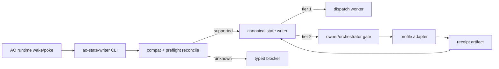

# AO Open Orchestrator

[简体中文](README.md)

AO Open Orchestrator is a reference implementation of a fail-closed,
repair-capable orchestration loop for agentic project execution.

The core idea is deliberately small:

- one canonical state writer;
- explicit action vocabulary;
- typed blockers instead of silent stalls;
- receipt-bound external review;
- profile-owned transports for local CLIs, browser automation, or desktop adapters;
- compatibility checks that fail closed when schema, contract, caller identity,
  or root identity changes.

This repository is the public-safe core. It excludes private runtime state,
local receipts, local transcripts, private account-bound automation evidence,
and machine-specific paths.

## What This Is

AO Open Orchestrator is not another scheduler. It expects an existing runtime
to wake or poke the loop. Within the runtime control surface, each
`ao-state-writer` tick is designed to reconcile canonical state and return one
of:

- continue with a supported action;
- enter typed repair or convergence;
- stop at an explicit gate.

The unattended goal is not to bypass every blocker. The goal is to avoid silent
stops inside the runtime control surface. Unknown actions, unsupported contract
versions, stale schema versions, mismatched roots, missing review receipts, and
unauthenticated callers become explicit machine-readable blockers. Host process
exit, system sleep, and external service failures still require an outer
supervisor to recover. Most gates are owner-proxy/orchestrator gates; current
human-owner intervention is reserved for explicitly human-only actions such as
master-plan edits or destructive operations.

## What This Is Not

- It is not an OpenAI API wrapper.
- It is not a queue, daemon, or second state source.
- It does not ship a universal ChatGPT Desktop controller that is safe on every
  machine; the bundled browser/CDP bridge is a reference adapter.
- It does not grant authority to modify a user's master plan or destructive
  operations without a current owner/orchestrator gate.

## Install

```bash
python3 -m venv .venv
. .venv/bin/activate
python -m pip install --upgrade pip setuptools
python -m pip install -e ".[dev]"
```

## Verify

```bash
python -m pytest -q
python scripts/public_safety_scan.py
git diff --check
```

## Quick Shape



## Repository Layout

- `src/ao_state_writer/` - canonical state writer, CLI, compatibility checks,
  preflight reconciliation, watchdog timeout proposal handling, and review
  adapter contract.
- `examples/` - sanitized contract and TODO examples.
- `docs/` - architecture, compatibility, receipt, and unattended-loop notes.
- `.github/` - Chinese-primary pull request and issue templates with English
  support text.
- `tests/` - public smoke/regression tests for the safety boundaries.
- `scripts/public_safety_scan.py` - guardrail that rejects local paths and
  private project identifiers before publishing.

## Design Rules

1. Keep `ao-state-writer` as the only canonical writer.
2. Keep runtime transport profile-owned.
3. Bind external receipts to package hash, submission nonce, artifact hash, gate
   proposal, and caller identity.
4. Treat unknown schema, unknown contract version, unknown action vocabulary,
   and non-canonical roots as fail-closed compatibility errors.
5. Repair missing evidence when safe; escalate only at explicit gates,
   human-only boundaries, or after the repair ladder is exhausted.

## Status

This is an alpha reference extraction. The mechanism is intended for operators
who can read and adapt the contract/profile boundary before running it on a real
project.
