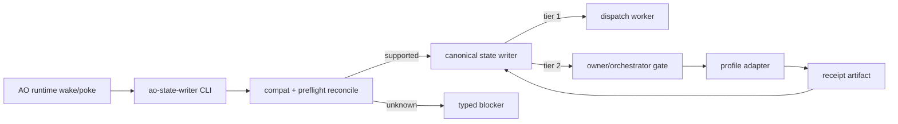

# AO Open Orchestrator

[English](README.en.md)

AO Open Orchestrator 是一个可审计、fail-closed、可持续 repair 的编排循环参考实现，用于让 agentic 项目执行在安全边界内推进。

它的核心故意保持很小：

- 一个唯一的 canonical state writer；
- 显式 action vocabulary；
- typed blocker，而不是静默停住；
- 绑定 receipt 的外部审查；
- transport 由 profile/adapter 拥有，比如本地 CLI、浏览器自动化、桌面 adapter；
- schema、contract、caller identity、root identity 变化时 fail-closed 的兼容边界。

这个仓库是 public-safe core。它不包含私有运行状态、本地 receipt、本地 transcript、账号绑定的桌面自动化证据或机器专属路径。

## 它是什么

AO Open Orchestrator 不是另一个 scheduler。它假设外层 AO-like runtime 负责 wake/poke；在 runtime 控制面内，每一次 tick 调用 `ao-state-writer` 后，都应落入三类结果之一：

- 继续执行一个受支持的 action；
- 进入 typed repair 或 convergence；
- 停在明确 gate。

无人值守的目标不是“绕过所有阻塞”，而是在 runtime 控制面内避免静默停住。未知 action、未知 contract version、过期 schema、root 不匹配、缺失 review receipt、caller 未授权，都会变成机器可读的明确 blocker。大多数 gate 是 owner-proxy/orchestrator gate；只有 master plan 修改、破坏性操作等明确 human-only action 才需要当前 human owner。宿主进程退出、系统休眠、外部服务失联等 runtime 外问题仍需要外层 supervisor 恢复。

## 它不是什么

- 它不是 OpenAI API wrapper。
- 它不是 queue、daemon 或第二状态源。
- 它不内置一个对所有机器都安全可用的 ChatGPT Desktop 控制器；仓库只提供可选 reference adapter。
- 它不会在没有当前 owner/orchestrator gate 的情况下授权修改 master plan 或执行破坏性操作。

## 安装

```bash
python3 -m venv .venv
. .venv/bin/activate
python -m pip install --upgrade pip setuptools
python -m pip install -e ".[dev]"
```

## 验证

```bash
python -m pytest -q
python scripts/public_safety_scan.py
git diff --check
```

## 快速结构



## 仓库结构

- `src/ao_state_writer/`：canonical state writer、CLI、兼容性检查、preflight reconcile、watchdog timeout proposal、review adapter contract。
- `examples/`：已脱敏的 contract 和 TODO 示例。
- `docs/`：中文为主、英文为辅的架构、兼容边界、receipt contract、无人值守 loop 说明。
- `.github/`：中文为主、英文为辅的 PR 模板和 issue 模板。
- `tests/`：公开 smoke/regression tests，覆盖关键安全边界。
- `scripts/public_safety_scan.py`：发布前公开安全扫描，拒绝本机路径和私有项目标识。

## 设计原则

1. `ao-state-writer` 是唯一 canonical writer。
2. runtime transport 选择属于 profile/adapter；仓库中的 GPT Pro browser/CDP bridge 只是 reference adapter。
3. 外部 receipt 必须绑定 package hash、submission nonce、artifact hash、gate proposal 和 caller identity。
4. 未知 schema、未知 contract version、未知 action vocabulary、non-canonical root 都必须 fail-closed。
5. 安全时自动 repair 缺失证据；只有明确 gate、human-only 边界或 repair ladder 耗尽后才升级。

## 状态

这是一个 alpha reference extraction。它面向能够阅读并适配 contract/profile boundary 的 operator；在真实项目上运行前，请先写好私有 profile，并跑完整测试和公开安全扫描。
